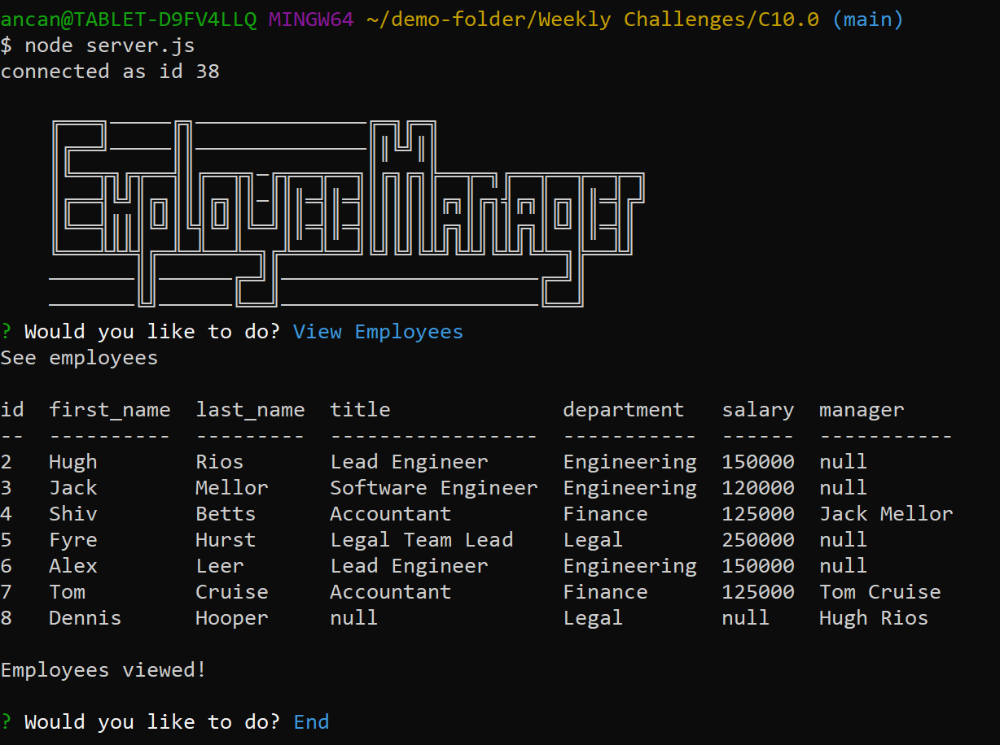

# SQL Employee Tracker README 
This is a command-line application that generates an employee tracker with the abiiliy to edit roles and employees.
  
  
  
  
  ## Table of Contents
  1. [Installation](#Installation)
  2. [Usage](#Usage)
  3. [Video](#Video)
  4. [License](#License)
  5. [Contributing](#Contributing)
  6. [Questions](#Questions)
  
  ## Installation 
  Clone this repository by clicking on the green button that says 'Fork'.
  Remeber to run the command npm i and
  to install dependencies before running the application your command line.
  
  ## Usage
  To run the application, make sure to install: node, mysql
  Invoke the applicaton with the command 

  > npm i
  > mysql2
  > npm i sequelize
  > npm i dotenv
  > node server.js 
  
  The command-line application should allow users to:

    Add departments, roles, employees

    View departments, roles, employees

    Update employee roles
  
  ## Video
  
  Watch the demo video: (insert video here)
  
  [Employee Tracker and Editor]

  Example:
 

  
  ## License
  This project operates under the MIT license
  
  
  
  ## Contributing 
  Contributions are welcome to fork the repoistory and contact me to report their progress.
  
  ## Questions
  
  GITHUB: https://github.com/Tojomojo
  EMAIL: liuya@uci.edu
  LINKEDIN: https://www.linkedin.com/in/yangyi-liu-5bbb1120a/